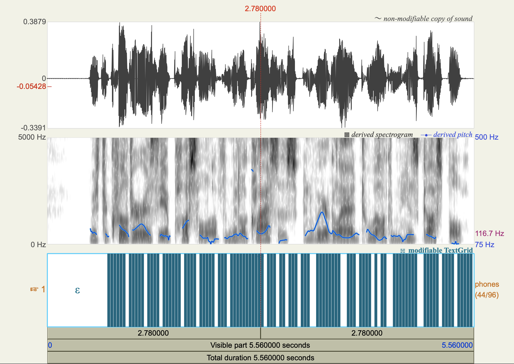
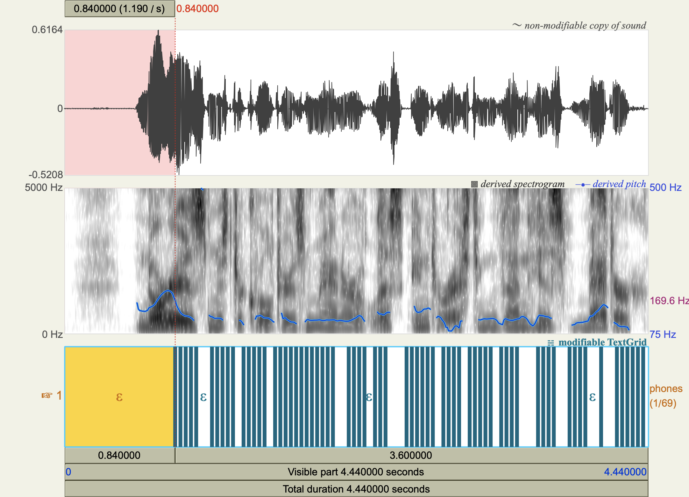

## Alignment Decoding

In this task, I tried to encode the audio file and then frame-synchronously decode features into the text, deciding what symbol I see at each frame. I did it using the pre-trained LSTM model. Through the architecture of the encoder, four input frames correspond to one output due to convolution downsampling.

Then, I used some examples from the LibraSpeech dev-clean dataset to test the encoder/decoder pipeline. To align predicted text with audio, I calculated timestamps by lengthening each predicted frame to four frames. I also merged all successive identical phonemes into one. The time per phoneme will be equal to the time of all predicted phonemes. I did this to have better visualization in Praatio. To be able to do a visualization, I presented all time intervals and phonemes in TextGrid format.

I included a couple of visualization from Praatio. From those data, we can see that our alignments between audio and data by lengthening each predicted frame to four frames don't show great results. In both visualizations, we see the most obvious problem with the first CTC blank token. While the speech started in the audio, we predicted silence. Such error I noticed during all audio. I have a couple of ideas about why this is happening. I think that different sounds have different durations, and we treat all sounds as if they have the same duration. Also, while calculating timestamps, we lengthen each predicted frame so the four next frames have the same label. But it might not be true.

